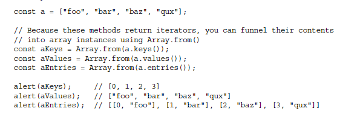

---

Basic

### Return an array computed from original

Back:

- `.map()`
📌: JS::JS-Array
🏷️: JS-Array
<!--ID: 1706600287395-->

---

---

Basic

### Iterative Methods-数组循环迭代方法

Back:

- `.forEach()` - 相当于使用 for 循环遍历数组
<!--ID: 1706600287399-->

---

---

Basic

### ES6 Destructuring (Iterator-迭代器方法)

Back:

- `for (const [i, ele] of a.entries()){ }`
- to split out the key/value pairs inside a loop
- 
- **`.keys()`**
  - return an iterator of the array's indices
- **`.values()`**
  - return an iterator of the array’s elements/values
- **`.entries()`**
  - return an iterator of index/value pairs
- 
<!--ID: 1706600287402-->

---

<!--SR:!2024-01-30,1,230-->
