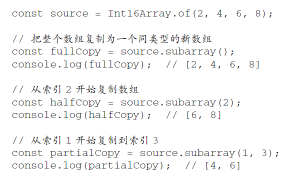

# Typed Array-定型数组

## 基本概念

- 历史
  - [Typed Array History-历史](Typed%20Array%20History-历史.md)
- 目的
  - 提高与 WebGL 等原生库交换二进制数据的效率 (efficiently passing binary data to native libraries) [📌](obsidian://jump-to-pdf?id=ProJS-ZN&annotate=d99d3af2-a246-c435)
- 功能
  - 读取或写入 [Array Buffer](ArrayBuffer%20缓冲.md)，引用 ArrayBuffer 中存储的二进制数据 [📌](obsidian://jump-to-pdf?id=ProJS-ZN&annotate=da5098cf-abd7-aad0)
- 特点
  - 特定于一种 [JS ElementType](ElementType.md) [📌](obsidian://jump-to-pdf?id=ProJS-ZN&annotate=d0c8811e-4015-b619)
  - 遵循系统原生的 [字节序](Endianness%20字节序.md) [📌](obsidian://jump-to-pdf?id=ProJS-ZN&annotate=3f26d80d-7226-addb)
  - 提供了适用面更广的 API 和更高的性能 [📌](obsidian://jump-to-pdf?id=ProJS-ZN&annotate=54394e5c-9e31-3878)
  - 没有用任何值初始化，则其关联的缓冲会以 0 填充 [📌](obsidian://jump-to-pdf?id=ProJS-ZN&annotate=449ecd6a-4700-d243)
- 相关概念
  - [ArrayBuffer 缓冲](ArrayBuffer%20缓冲.md)
  - [Dataview](Dataview.md)
  - 一个字节有 8 位（1 byte = **8** bits）
    - `Int32Array` 数组每个元素需要 **4** 字节
    - 用 12 字节的缓冲可以创建一个长度为 **3** 的 Int32Array 定型数组

## 创建方式

- 通过 [JS ElementType](ElementType.md)
  - `<ElementType>.from()`和`<ElementType>.of()` [📌](obsidian://jump-to-pdf?id=ProJS-ZN&annotate=1f91c41c-a6d7-3f41)
- 通过构造函数（构造函数参数）
- ?
  - 指定缓冲
    - `new Int32Array(buf)`
  - 指定长度
    - `new Int32Array(length)`
  - 指定元素值
    - `const ints3 = new Int32Array([2, 4, 6, 8]);`
  - 已有的定型数组（复制 ints3 的值创建一个 `Int16Array`）
    - `const ints4 = new Int16Array(ints3);`

## 实例属性

- BYTES_PER_ELEMENT [📌](obsidian://jump-to-pdf?id=ProJS-ZN&annotate=bc3783f4-e168-ea31)
  - 返回该类型数组中每个元素的大小

## 实例方法

- 与普通数组相似的方法
  -  [📌](obsidian://jump-to-pdf?id=ProJS-ZN&annotate=efaf4dda-e67e-94a2)
  -  [📌](obsidian://jump-to-pdf?id=ProJS-ZN&annotate=2cd981fe-8b4d-e6cb)
- 拼、删、增、截、改
  - 不适用的方法
    -  [📌](obsidian://jump-to-pdf?id=ProJS-ZN&annotate=6d6ac39d-c030-7453)
  - 复制数据的新方法
    - set() [📌](obsidian://jump-to-pdf?id=ProJS-ZN&annotate=febf8d19-0b8c-e53c)
      - 从提供的数组或定型数组中把值复制到当前定型数组中指定的索引位置 [📌](obsidian://jump-to-pdf?id=ProJS-ZN&annotate=93948f7e-b5f8-57b5)
        -  [📌](obsidian://jump-to-pdf?id=ProJS-ZN&annotate=833ff7bc-b582-28c9)
      - subarray() [📌](obsidian://jump-to-pdf?id=ProJS-ZN&annotate=17219271-1fd7-caaa)
        - 基于从原始定型数组中复制的值返回一个新定型数组 [📌](obsidian://jump-to-pdf?id=ProJS-ZN&annotate=42946009-b1ce-ac1f)
        - 开始索引和结束索引可选 [📌](obsidian://jump-to-pdf?id=ProJS-ZN&annotate=1aa13bd4-d289-948a)
        -  [📌](obsidian://jump-to-pdf?id=ProJS-ZN&annotate=566e9cb1-27ce-8d16)
  - 拼接方法
- 🟨 下溢和上溢-Underflow and Overflow [📌](obsidian://jump-to-pdf?id=ProJS-ZN&annotate=1144ee1c-f89c-5b14)
<!--SR:!2023-08-25,10,250-->
