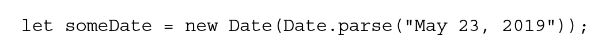
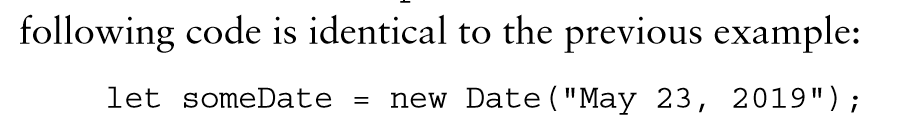
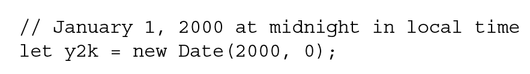

# [D-JS](O-JS.md) Date

## Metadata

- Up:: [C05-Basic Reference Types-基本引用类型](C05-Basic%20Reference%20Types-基本引用类型.md)

## <mark class="hltr-gray "> THE DATE TYPE </mark> [Page 2](zotero://open-pdf/library/items/6CRSJHBD?page=2&annotation=ZCMRAWIJ)

- <mark class="hltr-yellow "> stores dates as the number of milliseconds that have passed since midnight on January 1, 1970 UTC (Universal Time Coordinated-协调世界时) </mark> [Page 2](zotero://open-pdf/library/items/6CRSJHBD?page=2&annotation=MYDAG3IE)
  - 可以精确表示 1970 年 1 月 1 日之前及之后 285 616 年的日期
- `new Date()`

  - 功能

    - 创建日期对象，Get Current date and time

      - ```js
        let now = new Date();
        ```

  - 可接受的参数

    - <mark class="hltr-orange "> Date.parse() </mark> [Page 2](zotero://open-pdf/library/items/6CRSJHBD?page=2&annotation=S662XPX7)

      - 接收一个表示日期的字符串参数，尝试将这个字符串转换为表示该日期的毫秒数/timestamp
        - 
      - 
      - 

        - convert a timestamp to a date

      - ```JS
        new Date(`timestamp`)
        ```

    - <mark class="hltr-orange "> Date.UTC() </mark> [Page 3](zotero://open-pdf/library/items/6CRSJHBD?page=3&annotation=RBNL47JF)

      - 也返回日期的毫秒表示，但使用不同参数
        - <mark class="hltr-yellow "> the year, the zero-based month (January is 0, February is 1, and so on), the day of the month (1 through 31), and the hours (0 through 23), minutes, seconds, and milliseconds of the time. </mark> [Page 3](zotero://open-pdf/library/items/6CRSJHBD?page=3&annotation=VISGXEEJ)
        - <mark class="hltr-yellow "> (year and month) are required </mark> [Page 3](zotero://open-pdf/library/items/6CRSJHBD?page=3&annotation=NR4D2AYH)
      - 
      - 

      - ```JS

        new Date(2022, 10, 19, 15, 23, 5)
        //JS month starts from 0
        //return '2022 Nov 19 15:23:05'
        ```

  - Get the number of day passed from the current date

    - ```js
      Math.round(Math.abs(date - new Date()) / (1000 * 60 * 60 * 24));
      ```

## <mark class="hltr-orange "> Date.now() </mark> [Page 4](zotero://open-pdf/library/items/6CRSJHBD?page=4&annotation=KGGW86VJ)

- <mark class="hltr-yellow "> returns the millisecond representation of the date and time at which the method is executed </mark> [Page 4](zotero://open-pdf/library/items/6CRSJHBD?page=4&annotation=2XP5WKUA)
- get the current time stamp

  - ```JS
    Date.now()
    currentTime = new Date()
    currentTimeStamp = currentTime.getTime()
    ```

## <mark class="hltr-gray ">" Inherited Methods "</mark> [Page 4 ](zotero://open-pdf/library/items/6CRSJHBD?page=4&annotation=5HCPCWGE)

- <mark class="hltr-orange "> toLocaleString() </mark> [Page 4](zotero://open-pdf/library/items/6CRSJHBD?page=4&annotation=UXFHHPND)
  - <mark class="hltr-yellow "> — 2/1/2019 12:00:00 AM </mark> [Page 4](zotero://open-pdf/library/items/6CRSJHBD?page=4&annotation=C96L67H6)
- <mark class="hltr-orange "> toString() </mark> [Page 4](zotero://open-pdf/library/items/6CRSJHBD?page=4&annotation=TINIP3XR)
  - <mark class="hltr-yellow "> — Thu Feb 1 2019 00:00:00 GMT-0800 (Pacific Standard Time) </mark> [Page 4](zotero://open-pdf/library/items/6CRSJHBD?page=4&annotation=5DZ5LGVJ)
  - <mark class="hltr-yellow "> are useful only for debugging purposes, not for display purposes. </mark> [Page 4](zotero://open-pdf/library/items/6CRSJHBD?page=4&annotation=29GBXUR9)
- <mark class="hltr-orange "> valueOf() </mark> [Page 4](zotero://open-pdf/library/items/6CRSJHBD?page=4&annotation=DFNK4F2T)
  - <mark class="hltr-yellow "> doesn’t return a string at all because it is overridden to return the milliseconds representation of the date </mark> [Page 4](zotero://open-pdf/library/items/6CRSJHBD?page=4&annotation=UGXZVZK8)
- <mark class="hltr-orange "> less-than and greater-than </mark> [Page 4](zotero://open-pdf/library/items/6CRSJHBD?page=4&annotation=NLYX93XV)
  - <mark class="hltr-yellow "> will work appropriately </mark> [Page 4](zotero://open-pdf/library/items/6CRSJHBD?page=4&annotation=W6EF9K7V)

## <mark class="hltr-gray ">" Date/Time Component Methods "</mark> [Page 5 ](zotero://open-pdf/library/items/6CRSJHBD?page=5&annotation=PZVXXLDL)

- Get elements of Date
  - <mark class="hltr-yellow "> getFullYear() </mark> [Page 5](zotero://open-pdf/library/items/6CRSJHBD?page=5&annotation=4S7RS7PT)
  - <mark class="hltr-yellow "> getMonth() </mark> [Page 6](zotero://open-pdf/library/items/6CRSJHBD?page=6&annotation=SJDJWW9V)
  - <mark class="hltr-yellow "> getDate() </mark> [Page 6](zotero://open-pdf/library/items/6CRSJHBD?page=6&annotation=UMW97LYJ)
  - <mark class="hltr-yellow "> getDay() </mark> [Page 6](zotero://open-pdf/library/items/6CRSJHBD?page=6&annotation=9CY82CV6)
  - <mark class="hltr-yellow "> getHours() </mark> [Page 6](zotero://open-pdf/library/items/6CRSJHBD?page=6&annotation=BS34967L)
  - <mark class="hltr-yellow "> getMinutes() </mark> [Page 6](zotero://open-pdf/library/items/6CRSJHBD?page=6&annotation=CA8R3QVG)
  - <mark class="hltr-yellow "> getSeconds() </mark> [Page 6](zotero://open-pdf/library/items/6CRSJHBD?page=6&annotation=LMLWTUFG)
  - <mark class="hltr-yellow "> getMilliseconds() </mark> [Page 7](zotero://open-pdf/library/items/6CRSJHBD?page=7&annotation=6HDAWSD2)
  - <mark class="hltr-yellow "> getTime() </mark> [Page 5](zotero://open-pdf/library/items/6CRSJHBD?page=5&annotation=9IXEVMMN)
- convert a time stamp to a time

  - ```JS
    .getTime(`timeStamp/ mileseconds`)
    ```

- Change elements of Date

  - ```js
    .setFullYear(2040)
    .set...
    ```

## <mark class="hltr-gray ">" Date-Formatting Methods "</mark> [Page 5 ](zotero://open-pdf/library/items/6CRSJHBD?page=5&annotation=D67U4Q3M)

- Get a nice formatted Time string

  - ```js
    .toISOString
    ```

- Internationalizing Dates

  - Get the browser language

    - ```js
      navigator.language;
      ```

  - ISO Language Code Table:

    - www.lingoes.net

  - ```js
    new Intl.DateTimeFormat("en-US").format(new Date());
    // Options
    new Intl.DateTimeFormat("en-US", Options).format(new Date());
    Options = {
    	hour: "numeric",
    	minute: "",
    	day: "",
    	month: "long/ 2-digit",
    	year: "",
    	weekday: "long/ short/ narrow",
    };
    ```

- <mark class="hltr-yellow "> varies widely from browser to browser; can’t be employed in a user interface for consistent display of a date. </mark> [Page 5](zotero://open-pdf/library/items/6CRSJHBD?page=5&annotation=2UWQQLF5)
  - <mark class="hltr-orange "> toTimeString() </mark> [Page 5](zotero://open-pdf/library/items/6CRSJHBD?page=5&annotation=9MHKQMDP)
    - <mark class="hltr-yellow "> the date’s hours, minutes, seconds, and time zone </mark> [Page 5](zotero://open-pdf/library/items/6CRSJHBD?page=5&annotation=5PVN24X2)
  - <mark class="hltr-orange "> toDateString() </mark> [Page 5](zotero://open-pdf/library/items/6CRSJHBD?page=5&annotation=SKNPJRBI)
    - <mark class="hltr-yellow "> the date’s day of the week, month, day of the month, and year </mark> [Page 5](zotero://open-pdf/library/items/6CRSJHBD?page=5&annotation=MU8B2YDQ)
  - <mark class="hltr-orange "> toLocaleTimeString() </mark> [Page 5](zotero://open-pdf/library/items/6CRSJHBD?page=5&annotation=TTV5S3ZT)
    - <mark class="hltr-yellow "> the date’s hours, minutes, and seconds </mark> [Page 5](zotero://open-pdf/library/items/6CRSJHBD?page=5&annotation=4BYJDEPE)
  - <mark class="hltr-orange "> toLocaleDateString() </mark> [Page 5](zotero://open-pdf/library/items/6CRSJHBD?page=5&annotation=MY4FKK5R)
    - <mark class="hltr-yellow "> date’s day of the week, month, day of the month, and year in an implementation- and locale-specific format. </mark> [Page 5](zotero://open-pdf/library/items/6CRSJHBD?page=5&annotation=42B7WY6T)
  - <mark class="hltr-orange "> toUTCString() </mark> [Page 5](zotero://open-pdf/library/items/6CRSJHBD?page=5&annotation=3WUYLNCU)
    - <mark class="hltr-yellow "> the complete UTC date </mark> [Page 5](zotero://open-pdf/library/items/6CRSJHBD?page=5&annotation=64BGIF27)
