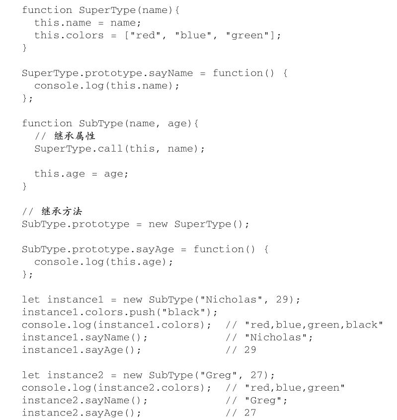
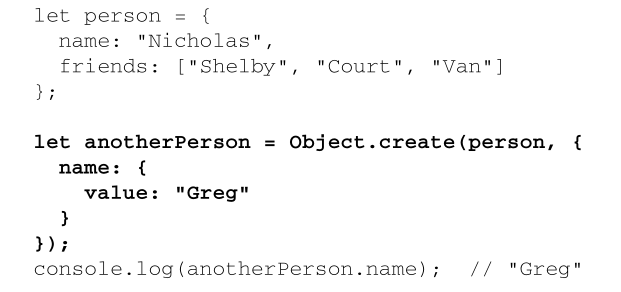

### OOP 语言支持的继承
* 接口继承
	* 继承方法签名（不支持）
* 实现继承
	* 继承实际的方法
	* 实现继承是 ECMAScript 唯一支持的继承方式
	* 通过原型链实现

### 原型链继承
* `SubType.prototype = new SuperType();`
* 通过原型链实现继承之后，搜索就可以继承向上，搜索原型的原型
	* 原型链扩展了前面描述的原型搜索机制
* 任何函数的默认原型都是一个 Object 的实例
* 子类有时候需要覆盖父类的方法，或者增加父类没有的方法
	* 这些方法必须在原型赋值之后再添加到原型上
	* 上述两个方法都是在把原型赋值为 SuperType 的实例之后定义的
#### 原型链的问题
* 原型中包含的引用值会在所有实例间共享
	* 所以属性通常会在构造函数中定义而不会定义在原型上
* 弱化了向构造函数传参能力，会导致所有实例默认都取得相同的属性值

### 盗用构造函数继承
* 在子类构造函数中调用父类构造函数
	* 可以使用`apply()`和`call()`方法以新创建的对象为上下文执行构造函数
* 盗用构造函数的优点
	* 也称作“对象伪装”或“经典继承”
	* 可以在子类构造函数中向父类构造函数传参
		* 实际上会在 SubType 的实例上定义`name`属性
			* `SuperType.call(this, "Nicholas");`
#### 盗用构造函数的问题
* 函数不能重用
* 子类也不能访问父类原型上定义的方法

### 组合继承
* 也叫伪经典继承
* 
	* `SuperType.call(this, name);`
	* `SubType.prototype = new SuperType();`
#### 效率问题
* 父类构造函数始终会被调用两次 
	* 一次在是创建子类原型时调用
	* 另一次是在子类构造函数中调用
* 解决方案：
	* 🏷️寄生式组合继承
#### 优点
* 综合了原型链和盗用构造函数，将两者的优点集中了起来
	* 使用原型链继承原型上的属性和方法，而通过盗用构造函数继承实例属性
	* 保留了`instanceof`操作符和`isPrototypeOf()`方法识别合成对象的能力
	* 使用最多的继承模式

### 原型式继承
* 对传入的对象执行了一次浅复制
	* 
* `Object.create()`
	* 只有一个参数时，`Object.create()`与这里的`object()`方法效果相同
	* 两个参数
		* 作为新对象原型的对象
		* 给新对象定义额外属性的对象（第二个可选）
			* 第二个参数与`Object.defineProperties()`的第二个参数一样
			* 每个新增属性都通过各自的描述符来描述
			* 会遮蔽原型对象上的同名属性
	* 
#### 优缺点
* 适合不需要单独创建构造函数，但仍然需要在对象间共享信息的场合
* 属性中包含的引用值始终会在相关对象间共享，跟使用原型模式是一样的

### ❓寄生式继承
* 寄生构造函数和工厂模式
	* 创建一个实现继承的函数，以某种方式增强对象，然后返回这个对象
#### 缺点
* 通过寄生式继承给对象添加函数会导致函数难以重用，与构造函数模式类似

### ❓寄生式组合继承
* 使用寄生式继承来继承父类原型，但使用混合式原型链继承方法
* 
#### 优点
* 寄生式组合继承可以算是引用类型继承的最佳模式
	* 避免了`SubType.prototype`上不必要也用不到的属性

### Reference
- [Object-oriented programming - Learn web development | MDN](https://developer.mozilla.org/en-US/docs/Learn/JavaScript/Objects/Object-oriented_programming)
- [Object-oriented Programming in JavaScript: Made Super Simple | Mosh - YouTube](https://www.youtube.com/watch?v=PFmuCDHHpwk)

### ❓Use Case

