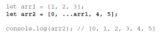

# Iteration and Spread Operators 迭代与扩展操作

## ECMAScript 6 新增的迭代器和扩展操作符对集合引用类型特别有用 [📌](obsidian://jump-to-pdf?id=ProJS-ZN&annotate=9f801676-c5e0-442d)

## [C07-Iterators and Generators-迭代器与生成器](C07-Iterators%20and%20Generators-迭代器与生成器.md)

## 让集合类型之间 相互操作、复制和修改变得异常方便 [📌](obsidian://jump-to-pdf?id=ProJS-ZN&annotate=a4ebc2f7-a0ee-35fc)

## 4 种原生集合类型定义了默认迭代器 [📌](obsidian://jump-to-pdf?id=ProJS-ZN&annotate=4a90a053-4b18-1dbd)

- Array [📌](obsidian://jump-to-pdf?id=ProJS-ZN&annotate=7d4c2338-0cfb-4f0b)
- 所有定型数组 [📌](obsidian://jump-to-pdf?id=ProJS-ZN&annotate=9cefba7f-e4c1-690f)
- Map [📌](obsidian://jump-to-pdf?id=ProJS-ZN&annotate=04045139-f00d-1788)
- Set [📌](obsidian://jump-to-pdf?id=ProJS-ZN&annotate=90abcd87-bd93-6b9b)

## 都支持顺序迭代，都可以传入 for-of 循环 [📌](obsidian://jump-to-pdf?id=ProJS-ZN&annotate=0e1b0556-41c6-1475)

## 都兼容扩展操作符 [📌](obsidian://jump-to-pdf?id=ProJS-ZN&annotate=bf35d48a-c8ae-475a)

- 扩展操作符在对可迭代对象执行浅复制时特别有用， 只需简单的语法就可以复制整个对象 [📌](obsidian://jump-to-pdf?id=ProJS-ZN&annotate=3dc50145-1288-1070)
-  [📌](obsidian://jump-to-pdf?id=ProJS-ZN&annotate=68519783-683f-dab7)

## 只要传入一个可迭代对象就可以实现复制 [📌](obsidian://jump-to-pdf?id=ProJS-ZN&annotate=04ed2322-0033-d7bf)

-  [📌](obsidian://jump-to-pdf?id=ProJS-ZN&annotate=8059ec2c-548a-6bc0)

## 也可以构建数组的部分元素 [📌](obsidian://jump-to-pdf?id=ProJS-ZN&annotate=e2fada41-689f-3aa5)

-  [📌](obsidian://jump-to-pdf?id=ProJS-ZN&annotate=67b2f001-e4c0-2ce6)

## 浅复制意味着只会复制对象引用 [📌](obsidian://jump-to-pdf?id=ProJS-ZN&annotate=50d87cd0-4370-dc90)

-  [📌](obsidian://jump-to-pdf?id=ProJS-ZN&annotate=3ef388e9-f4a3-bf22)

## 都支持多种构建方法，比如 Array.of()和 Array.from()静态方法。在与扩展操 作符一起使用时，可以非常方便地实现互操作 [📌](obsidian://jump-to-pdf?id=ProJS-ZN&annotate=935d9d73-5608-96b2)

## // 把数组复制到定型数组 [📌](obsidian://jump-to-pdf?id=ProJS-ZN&annotate=d18a58da-bab5-22de)

- let typedArr1 = Int16Array.of(...arr1); let typedArr2 = Int16Array.from(arr1); console.log(typedArr1); // Int16Array [1, 2, 3] console.log(typedArr2); // Int16Array [1, 2, 3] [📌](obsidian://jump-to-pdf?id=ProJS-ZN&annotate=8631b38e-4ebe-f205)

## // 把数组复制到映射 [📌](obsidian://jump-to-pdf?id=ProJS-ZN&annotate=519046fb-8ef3-0387)

- let map = new Map(arr1.map((x) => [x, 'val' + x])); console.log(map); // Map {1 => 'val 1', 2 => 'val 2', 3 => 'val 3'} [📌](obsidian://jump-to-pdf?id=ProJS-ZN&annotate=7467df8b-4146-da0d)

## // 把数组复制到集合 [📌](obsidian://jump-to-pdf?id=ProJS-ZN&annotate=a305bf4a-525c-4154)

- let set = new Set(typedArr2); console.log(set); // Set {1, 2, 3} [📌](obsidian://jump-to-pdf?id=ProJS-ZN&annotate=fdc840c0-8dc2-be6b)
- // 把集合复制回数组 [📌](obsidian://jump-to-pdf?id=ProJS-ZN&annotate=27c339ef-aa64-61b1)
- let arr2 = [...set]; console.log(arr2); // [1, 2, 3] [📌](obsidian://jump-to-pdf?id=ProJS-ZN&annotate=ad19c779-480e-4196)
