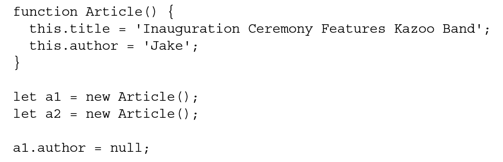

# Garbage Collection-垃圾回收
##  garbage-collected language 

-  automatically allocating what is needed and reclaiming memory that is no longer being used  
- " Mark-and-Sweep 标记清理" 
  - 除所有在上下文中的变量，以及被在上下文中的变量引用的变量外的变量将被标记清理
- " Reference Counting 引用计数" 
  - 对每个值都记录它被引用的次数，引用为 0 则被清理

## " Performance " 

- 垃圾回收程序会周期性运行，如果内存中分配了很多变量，则可能造成性能损失，因此垃圾回收的时间调度很重要。
-  minimizing the number of garbage collection operations the browser performs-合理使用分配的内存，并避免多余的垃圾回收. 
  - 浏览器决定何时运行垃圾回收程序的一个标准就是对象更替的速度。如果有很多对象被初始化，然后一下子又都超出了作用域，那么浏览器就会采用更激进的方式调度垃圾回收程序运行

## " Managing Memory " 

-  memory limits affect 内存限制会影响 
  -  variable allocation 变量分配  
  -  call stack 调用栈
  -  number of statements that can be executed in a single thread 同在一个线程执行的语句数量 
- 优化内存占用的最佳手段
  -  dereferencing the value 解除引用 
    -  When data is no longer necessary, it’s best to set the value to null, freeing up the reference  
    -  applies mostly to global values and properties of global objects
    - 
  - " Use const and let Declarations " 
    -  signal to the garbage collector that an allocated variable is eligible for cleanup far sooner 
  - " Hidden Classes and the delete Operation-隐藏类与删除操作 "
    -  V8 will associate hidden classes for every object created to keep track of the shape of its properties 
      -  Objects that are able to share the same hidden class will have better performance 
    - 在构造函数中一次性声明所有属性
      - 避免动态添加属性
        - 
      - 避免动态删除属性
        -  Best practices dictate that unwanted properties should be set to null. 
        - 
  - " Memory Leaks-内存泄漏 3 种情形避免" 
    -  the variable is not prefixed with a declaration keyword  
      - 没有用关键字声明变量，意外声明全局变量
    -  Interval timers 
      - 定时器的回调通过闭包引用了外部变量
    -  JavaScript closures 
      - 函数内的闭包引用了外部变量
  - " Static Allocation and Object Pools 静态分配与对象池"
    -  object pool-对象池 
      - 管理一组可回收的对象。
        - 应用程序可以向这个对象池请求一个对象、设置其属性、使用它，然后在操作完成后再把它还给对象池。由于没发生对象初始化，垃圾回收探测就不会发现有对象更替，因此垃圾回收程序就不会那么频繁地运行。
      - 对象池必须使用某种结构维护所有对象，数组是比较好的选择
        - 在初始化时就创建一个大小够用的数组，从而避免上述先删除再创建的操作
      - 静态分配是优化的一种极端形式，大多数情况下，这都属于过早优化，因此不用考虑。
