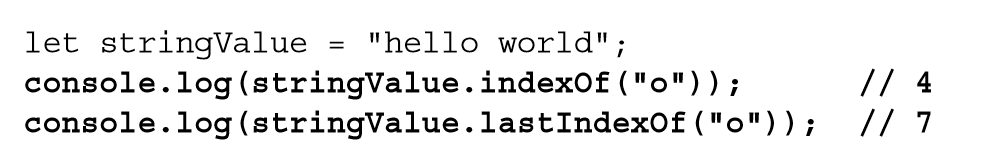
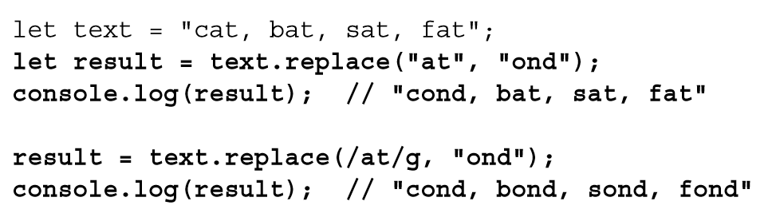
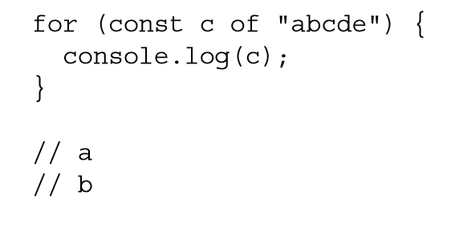

# String Instance Methods

## Reference

### [Useful string methods - Learn web development | MDN](https://developer.mozilla.org/en-US/docs/Learn/JavaScript/First_steps/Useful_string_methods)

## 空

### <mark class="hltr-gray ">" The trim() Method——去空格"</mark> [Page 27 ](zotero://open-pdf/library/items/6CRSJHBD?page=27&annotation=UHGAI8KR)

- <mark class="hltr-orange "> trim() </mark> [Page 27](zotero://open-pdf/library/items/6CRSJHBD?page=27&annotation=J42P9UMD)
  - Remove white space or new line in a string
  - <mark class="hltr-yellow "> creates a copy of the string, removes all leading and trailing white space, and then returns the result. </mark> [Page 27](zotero://open-pdf/library/items/6CRSJHBD?page=27&annotation=FHTKHX2E)
- <mark class="hltr-orange "> trimLeft() </mark> [Page 27](zotero://open-pdf/library/items/6CRSJHBD?page=27&annotation=YKAK5BT7)
- <mark class="hltr-orange "> trimRight() </mark> [Page 27](zotero://open-pdf/library/items/6CRSJHBD?page=27&annotation=TY5B2WF7)

## 位

### <mark class="hltr-gray ">" String Location Methods——位置"</mark> [Page 26 ](zotero://open-pdf/library/items/6CRSJHBD?page=26&annotation=K3CKKLCB)

- <mark class="hltr-orange "> indexOf() </mark> [Page 26](zotero://open-pdf/library/items/6CRSJHBD?page=26&annotation=YMZ4ZN6R)
- <mark class="hltr-orange "> lastIndexOf() </mark> [Page 26](zotero://open-pdf/library/items/6CRSJHBD?page=26&annotation=IVU8QJS4)
  - 
- <mark class="hltr-yellow "> Each method accepts an optional second argument that indicates the position to start searching from within the string. </mark> [Page 26](zotero://open-pdf/library/items/6CRSJHBD?page=26&annotation=XJ3NSRXM)

## 大

### <mark class="hltr-gray ">" String Case Methods——大小写 "</mark> [Page 29 ](zotero://open-pdf/library/items/6CRSJHBD?page=29&annotation=QJNZ78U8)

- <mark class="hltr-orange "> toLowerCase() </mark> [Page 29](zotero://open-pdf/library/items/6CRSJHBD?page=29&annotation=HUZ3SUD5)
- <mark class="hltr-orange "> toUpperCase() </mark> [Page 29](zotero://open-pdf/library/items/6CRSJHBD?page=29&annotation=I98JCQQS)
- <mark class="hltr-orange "> toLocaleLowerCase() </mark> [Page 29](zotero://open-pdf/library/items/6CRSJHBD?page=29&annotation=995T2WUK)
- <mark class="hltr-orange "> toLocaleUpperCase() </mark> [Page 29](zotero://open-pdf/library/items/6CRSJHBD?page=29&annotation=3U2BTSQD)
- 为什么有地区特定语言大小写转换
  - 如果不知道代码涉及什么语言，则最好使用地区特定的转换方法
  - 在少数语言中（如土耳其语），Unicode 大小写转换需应用特殊规则，要使用地区特定的方法才能实现正确转换

## 包

### <mark class="hltr-gray ">" String Inclusion Methods——包含 "</mark> [Page 27 ](zotero://open-pdf/library/items/6CRSJHBD?page=27&annotation=B9WYFDGA)

- Check if elements in a string
- <mark class="hltr-orange "> startsWith() </mark> [Page 27](zotero://open-pdf/library/items/6CRSJHBD?page=27&annotation=VJ54MHHN)
  - <mark class="hltr-yellow "> The startsWith() and includes() methods accept an optional second argument that indicates the position to start searching from within the string. </mark> [Page 27](zotero://open-pdf/library/items/6CRSJHBD?page=27&annotation=6C6GB4MC)
- <mark class="hltr-orange "> endsWith() </mark> [Page 27](zotero://open-pdf/library/items/6CRSJHBD?page=27&annotation=X8MZ6W2B)
  - <mark class="hltr-yellow "> The endsWith() method accepts an optional second argument that indicates the position that should be treated as the end of the string. </mark> [Page 27](zotero://open-pdf/library/items/6CRSJHBD?page=27&annotation=2W8I27DE)
- <mark class="hltr-orange "> includes() </mark> [Page 27](zotero://open-pdf/library/items/6CRSJHBD?page=27&annotation=WQDXBYQQ)

## 操

### <mark class="hltr-gray ">" String-Manipulation Methods——操作"</mark> [Page 24 ](zotero://open-pdf/library/items/6CRSJHBD?page=24&annotation=87P4LDHG)

- <mark class="hltr-orange "> 拼接方法 concat() </mark> [Page 24](zotero://open-pdf/library/items/6CRSJHBD?page=24&annotation=S8W8WKMB)
  - <mark class="hltr-yellow "> concatenate one or more strings to another, returning the concatenated string as the result. </mark> [Page 24](zotero://open-pdf/library/items/6CRSJHBD?page=24&annotation=QDESJDLV)
    - 
  - <mark class="hltr-yellow "> it can create a string from any number of other strings </mark> [Page 24](zotero://open-pdf/library/items/6CRSJHBD?page=24&annotation=TZ45IYHT)
  - <mark class="hltr-orange "> the addition operator (+) </mark> [Page 24](zotero://open-pdf/library/items/6CRSJHBD?page=24&annotation=G7ZM4RZY)
    - <mark class="hltr-yellow "> used more often and, in most cases, actually performs better than the concat() method even when concatenating multiple strings. </mark> [Page 24](zotero://open-pdf/library/items/6CRSJHBD?page=24&annotation=YBEPCSH7)
- 拆合方法-split, join

  - ```js
    .split('divider')
    //to split the string by a divider in the string
    .join(' ')
    //to join split strings with a specified divider to one string
    ```

- 截取方法-slice, substring, substr
  - <mark class="hltr-orange "> slice() </mark> [Page 24](zotero://open-pdf/library/items/6CRSJHBD?page=24&annotation=5I8HNM95)
    - <mark class="hltr-yellow "> they simply return a primitive string value as the result, leaving the original unchanged </mark> [Page 25](zotero://open-pdf/library/items/6CRSJHBD?page=25&annotation=W2DYMQ36)
  - <mark class="hltr-orange "> substring() </mark> [Page 24](zotero://open-pdf/library/items/6CRSJHBD?page=24&annotation=F4V7FGRB)
    - <mark class="hltr-yellow "> For the substring() method, all negative numbers are converted to 0 </mark> [Page 25](zotero://open-pdf/library/items/6CRSJHBD?page=25&annotation=MMGNNK9A)
    - <mark class="hltr-orange "> There are different behaviors for these methods when an argument is a negative number. </mark> [Page 25](zotero://open-pdf/library/items/6CRSJHBD?page=25&annotation=RAN8KSE3)
  - <mark class="hltr-orange "> substr() </mark> [Page 25](zotero://open-pdf/library/items/6CRSJHBD?page=25&annotation=AQ366DXI)
    - <mark class="hltr-yellow "> the second argument is the number of characters to return </mark> [Page 25](zotero://open-pdf/library/items/6CRSJHBD?page=25&annotation=5UF687YR)
  - 
  - 

## 查

### <mark class="hltr-gray ">" String Pattern-Matching Methods——查找匹配替换"</mark> [Page 29 ](zotero://open-pdf/library/items/6CRSJHBD?page=29&annotation=Y9G2P237)

- <mark class="hltr-orange "> match() </mark> [Page 29](zotero://open-pdf/library/items/6CRSJHBD?page=29&annotation=WG6WQZ2J)
  - 参数
    - 正则表达式字符串或 RegExp 对象
  - 
- <mark class="hltr-orange "> search() </mark> [Page 30](zotero://open-pdf/library/items/6CRSJHBD?page=30&annotation=D6W6UKHA)
  - 参数
    - 正则表达式字符串或 RegExp 对象
  - 返回值
    - 返回模式第一个匹配的位置索引，如果没找到则返回 -1。
  - 特点
    - search() 始终从字符串开头向后匹配模式
  - 
- <mark class="hltr-orange "> replace() </mark> [Page 30](zotero://open-pdf/library/items/6CRSJHBD?page=30&annotation=W6SB8XLJ)
  - 参数
    - 两个参数：1. 字符串或 RegExp 对象；2.新字符串
  - 

## 序

### <mark class="hltr-gray ">" The localeCompare() Method——位置顺序判断 "</mark> [Page 32 ](zotero://open-pdf/library/items/6CRSJHBD?page=32&annotation=EYLW8PV5)

- <mark class="hltr-orange "> localeCompare() </mark> [Page 32](zotero://open-pdf/library/items/6CRSJHBD?page=32&annotation=9M7KNRB2)
  - 

## 重

### <mark class="hltr-gray ">" The repeat() Method——重复"</mark> [Page 28 ](zotero://open-pdf/library/items/6CRSJHBD?page=28&annotation=HPTIT6M4)

- <mark class="hltr-orange "> repeat() </mark> [Page 28](zotero://open-pdf/library/items/6CRSJHBD?page=28&annotation=SUJL25K8)
  - Repeat a String
  - <mark class="hltr-yellow "> accepts a single integer argument count, copies the string count times, and concatenates all the copies </mark> [Page 28](zotero://open-pdf/library/items/6CRSJHBD?page=28&annotation=LBHKWIZY)
  - 

## 填

### <mark class="hltr-gray ">" The padStart() and padEnd() Methods——填充"</mark> [Page 28 ](zotero://open-pdf/library/items/6CRSJHBD?page=28&annotation=4S9JYAE6)

- <mark class="hltr-yellow "> will copy a string and, if the length of the string is less than the specified length, add padding to either side of a string to extend it to a certain length. </mark> [Page 28](zotero://open-pdf/library/items/6CRSJHBD?page=28&annotation=CGKY4PIK)
- 

- ```js

  .padStart(20, '+')
  .padEnd
  //to add symbols to a string to a certain length
  ```

## <mark class="hltr-gray ">" String Iterators and Destructuring——迭代与解构"</mark> [Page 28 ](zotero://open-pdf/library/items/6CRSJHBD?page=28&annotation=LZID94FV)

### <mark class="hltr-yellow "> in a for of loop </mark> [Page 28](zotero://open-pdf/library/items/6CRSJHBD?page=28&annotation=DPBN3MUF)

- 

### <mark class="hltr-yellow "> with the destructuring operator </mark> [Page 29](zotero://open-pdf/library/items/6CRSJHBD?page=29&annotation=YRVY6RB4)

- <mark class="hltr-yellow "> allows you to easily split a string by its characters </mark> [Page 29](zotero://open-pdf/library/items/6CRSJHBD?page=29&annotation=TBZ8Q45P)
- 

## <mark class="hltr-gray ">" HTML Methods "</mark> [Page 33 ](zotero://open-pdf/library/items/6CRSJHBD?page=33&annotation=F97NKWWU)

### Deprecated
