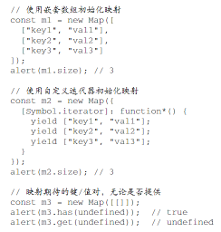

# Map

## 创建方式

- 构造函数
  - `const m = new Map()`
- 构造函数参数（初始化实例）
  - 嵌套数组
  - 自定义迭代器 iterator
  - 空数组
  -  [📌](obsidian://jump-to-pdf?id=ProJS-ZN&annotate=c087dff3-79bc-3917)
  - 在映射中用作键和值的对象及其他“集合”类型，在自己的内容或属性被修改时 仍然保持不变 [📌](obsidian://jump-to-pdf?id=ProJS-ZN&annotate=9e76a4dc-804b-df5a)
  - delete()和 clear() [📌](obsidian://jump-to-pdf?id=ProJS-ZN&annotate=11acae9e-7a4c-fe5d)
  - size 属性 [📌](obsidian://jump-to-pdf?id=ProJS-ZN&annotate=656a56cf-4ba9-b436)
  - set()方法再添加键/值对。另外，可以使用 get()和 has()进行查询 [📌](obsidian://jump-to-pdf?id=ProJS-ZN&annotate=2becc825-5678-13eb)
  - 使用严格对象相等的标准来检查键的匹配性 [📌](obsidian://jump-to-pdf?id=ProJS-ZN&annotate=095bc65e-fc97-c2b3)
  - 与 Object 类型的一个主要差异是，Map 实例会维护键值对的插入顺序 [📌](obsidian://jump-to-pdf?id=ProJS-ZN&annotate=b1de0d01-87b4-e9e7)
  - set()方法返回映射实例，因此可以把多个操作连缀起来，包括初始化声明 [📌](obsidian://jump-to-pdf?id=ProJS-ZN&annotate=a7ec7ae7-1ea2-0959)
  - 迭代操作 [📌](obsidian://jump-to-pdf?id=ProJS-ZN&annotate=d8b1a8f6-f3b3-123c)
  - alert(m.entries === m[Symbol.iterator]); // true [📌](obsidian://jump-to-pdf?id=ProJS-ZN&annotate=597aa12b-2fdf-e11f)
  - Symbol.iterator 属性 [📌](obsidian://jump-to-pdf?id=ProJS-ZN&annotate=c7ca45ad-b948-a2cc)
  - entries()方法 [📌](obsidian://jump-to-pdf?id=ProJS-ZN&annotate=e38e4327-065e-d5cd)
  - console.log([...m]); // [key1,val1],[key2,val2],[key3,val3](key1,val1],[key2,val2],[key3,val3) [📌](obsidian://jump-to-pdf?id=ProJS-ZN&annotate=236f7bbe-ccdf-428f)
  - forEach(callback, opt_thisArg) [📌](obsidian://jump-to-pdf?id=ProJS-ZN&annotate=40288775-8d63-01c2)
  - 传入的回调接收可选的第二个参数，这个参数用于重写回调 内部 this 的值 [📌](obsidian://jump-to-pdf?id=ProJS-ZN&annotate=9ed3c264-5811-2686)
  - keys()和 values() [📌](obsidian://jump-to-pdf?id=ProJS-ZN&annotate=fc1253e8-9c3a-a36f)
  - 键和值在迭代器遍历时是可以修改的 [📌](obsidian://jump-to-pdf?id=ProJS-ZN&annotate=34c76393-d32e-1033)

## 选择 Object 还是 Map

- Map 大约可以比 Object 多存储 50%的键/值对 [📌](obsidian://jump-to-pdf?id=ProJS-ZN&annotate=84f1127c-4ce2-89a4)
- 内存占用 [📌](obsidian://jump-to-pdf?id=ProJS-ZN&annotate=cf22f01f-19f7-504e)
- 插入性能 [📌](obsidian://jump-to-pdf?id=ProJS-ZN&annotate=21ccb2a4-c463-c139)
- 查找速度 [📌](obsidian://jump-to-pdf?id=ProJS-ZN&annotate=d0cc7d81-134d-0fd2)
- 删除性能 [📌](obsidian://jump-to-pdf?id=ProJS-ZN&annotate=fc186407-6a61-390d)
- 插入 Map 在所有浏览器中一般会稍微快 一点儿 [📌](obsidian://jump-to-pdf?id=ProJS-ZN&annotate=8e6d4014-790a-c0ab)
- 如果只包含少量键/值对， 则 Object 有时候速度更快。 [📌](obsidian://jump-to-pdf?id=ProJS-ZN&annotate=26fbbe68-380f-a8db)
- Map 的 delete()操作都比插入和查找更快 [📌](obsidian://jump-to-pdf?id=ProJS-ZN&annotate=75260cfd-72cf-2774)
