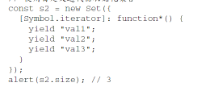

# Set

## <mark class="hltr-gray ">" Basic API "</mark> [Page 45 ](zotero://open-pdf/library/items/J32BLJDJ?page=45&annotation=C7JHRP8H)

- Set 在很多方面都 像是加强的 Map [📌](obsidian://jump-to-pdf?id=ProJS-ZN&annotate=a4b8fbb2-7042-4601)
- 它们的大多数 API 和行为都是共有的 [📌](obsidian://jump-to-pdf?id=ProJS-ZN&annotate=219a8ee1-5129-9c94)
- const m = new Set(); [📌](obsidian://jump-to-pdf?id=ProJS-ZN&annotate=b4a18ac6-b143-37b5)
- 可以给 Set 构造函数传入一个可迭代对象 [📌](obsidian://jump-to-pdf?id=ProJS-ZN&annotate=68b7d831-df0e-0968)
- 使用数组初始化集合 [📌](obsidian://jump-to-pdf?id=ProJS-ZN&annotate=53a66a2b-d511-57ce)
- 使用自定义迭代器初始化集合 [📌](obsidian://jump-to-pdf?id=ProJS-ZN&annotate=7b31fee1-94c1-0999)
-  [📌](obsidian://jump-to-pdf?id=ProJS-ZN&annotate=359f5666-3c14-4671)
-  [📌](obsidian://jump-to-pdf?id=ProJS-ZN&annotate=07137011-754f-b518)
- add() [📌](obsidian://jump-to-pdf?id=ProJS-ZN&annotate=449f76e7-971e-c134)
- has() [📌](obsidian://jump-to-pdf?id=ProJS-ZN&annotate=6f8e1ccd-2ff6-dd3b)
- size [📌](obsidian://jump-to-pdf?id=ProJS-ZN&annotate=0880b57c-288a-9597)
- delete() [📌](obsidian://jump-to-pdf?id=ProJS-ZN&annotate=72869eb0-4f63-9558)
- clear() [📌](obsidian://jump-to-pdf?id=ProJS-ZN&annotate=71a2a037-40fe-4a1c)
-  [📌](obsidian://jump-to-pdf?id=ProJS-ZN&annotate=264f5977-4577-e529)
- add()返回集合的实例，所以可以将多个添加操作连缀起来，包括初始化 [📌](obsidian://jump-to-pdf?id=ProJS-ZN&annotate=732b21f0-3b2e-1af0)
-  [📌](obsidian://jump-to-pdf?id=ProJS-ZN&annotate=2beb466e-a27a-2f92)
- 与 Map 类似，Set 可以包含任何 JavaScript 数据类型作为值 [📌](obsidian://jump-to-pdf?id=ProJS-ZN&annotate=d41e0e9c-5262-784a)
- 相当于使用严格对象相等的标准来检查值的匹 配性 [📌](obsidian://jump-to-pdf?id=ProJS-ZN&annotate=3607ac8a-efa0-9903)
- delete()返回一个布尔值，表示集合中是否存在要删除的值 [📌](obsidian://jump-to-pdf?id=ProJS-ZN&annotate=e159d6c4-5a66-75ab)

## <mark class="hltr-gray ">" Order and Iteration "</mark> [Page 47 ](zotero://open-pdf/library/items/J32BLJDJ?page=47&annotation=AS8YRZ58)

- 支持按顺序迭代 [📌](obsidian://jump-to-pdf?id=ProJS-ZN&annotate=2fcd07a8-8bce-41d3)
  - 可以直接对集合实例使用扩展操作，把集合转换为数组 [📌](obsidian://jump-to-pdf?id=ProJS-ZN&annotate=1942ab82-8d31-8620)
  -  [📌](obsidian://jump-to-pdf?id=ProJS-ZN&annotate=7c79f740-bc38-96cd)
  -  [📌](obsidian://jump-to-pdf?id=ProJS-ZN&annotate=3e8fc121-7a17-b0cb)
    - forEach() [📌](obsidian://jump-to-pdf?id=ProJS-ZN&annotate=a38088fc-79e2-b793)
    - 传入的回调接收可选的第二个参数，这个参数用于重写回调内部 this 的值 [📌](obsidian://jump-to-pdf?id=ProJS-ZN&annotate=ff2f0343-6c29-55a0)

## <mark class="hltr-gray ">" Defining Formal Set Operations "</mark> [Page 49 ](zotero://open-pdf/library/items/J32BLJDJ?page=49&annotation=7LAED8W2)

- 子类化 Set [📌](obsidian://jump-to-pdf?id=ProJS-ZN&annotate=5e508054-c372-c8f9)
  - 定义一 个实用函数库 [📌](obsidian://jump-to-pdf?id=ProJS-ZN&annotate=675227d6-e8f6-2225)
  - 两种方式合二为一，可以在子类上实现静态方法，然后在实例方法中使用这些静态 方法 [📌](obsidian://jump-to-pdf?id=ProJS-ZN&annotate=1003f025-6db8-55cf)
