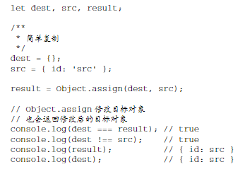
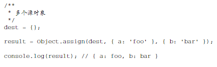
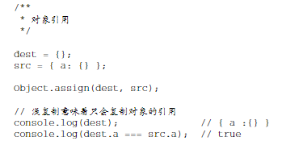
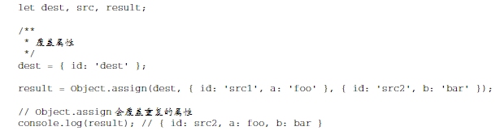

## Assign Merge Objects (ES6 对象合并)

?

- `Object.assign()`
  - 把源对象所有的本地属性一起复制到目标对象上，目标对象通过混入源对象的属性得到了增强
  - 参数
    - 一个目标对象
    - 一个或多个源对象
  - 示例
    - 
    - 
  - 特点
    - 对每个源对象执行的是浅复制
      - 
    - 如果多个源对象都有相同的属性，则使 用最后一个复制的值
      - 
    - 不能在两个对象间转移获取函数和设置函数
