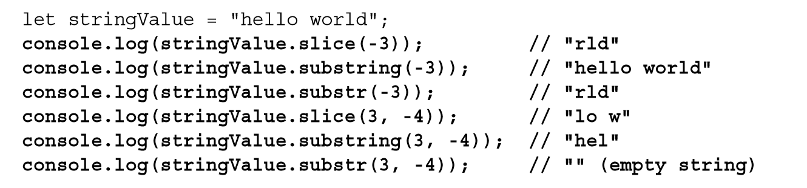

# String Slice, Substring, Substr (截取方法)

- slice()
  - they simply return a primitive string value as the result, leaving the original unchanged
- substring()
  - For the substring() method, all negative numbers are converted to 0
  - There are different behaviors for these methods when an argument is a negative number.
- substr()
  - the second argument is the number of characters to return
- 
- 
