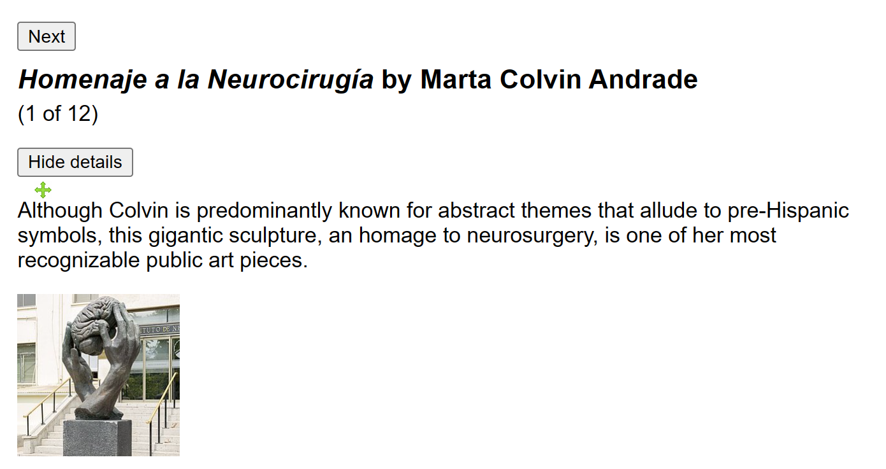
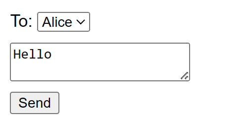
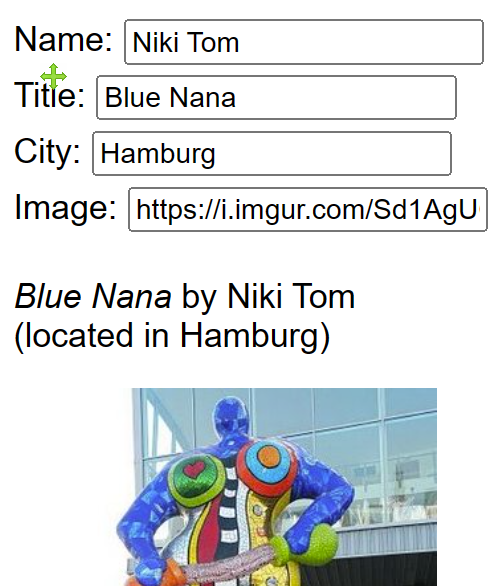

# Add Interactivity with State

## State: a component's memory

- Build an Art Gallery page
  - 
  - 📌`04-1-Gallery.jsx`

## State as a snapshot

React state behaves more like a snapshot. Setting it does not change the state variable you already have, but instead triggers a re-render.

- 📌`04-2-Chat.jsx`
  - 

## Queueing a series of state updates

- 📌`04-3-Scores.jsx`
  - replacing `setScore(score + 1)` with `setScore(s => s + 1)` fixes the “+3” button.

## Updating objects in state

State can hold any kind of JavaScript value, including objects. But avoid mutate the origin objects or arrays stored in state.

use the `...` spread syntax to copy objects and arrays that you want to change.

- 📌`04-4-Objects.jsx`
  - 
- 📌`04-4-ImmerObjects.jsx`
  - Use [Immer](https://github.com/immerjs/use-immer) instead of `useState` in this case to reduce repetitive code.
  - npm install the following dependencies
    - "immer": "1.7.3",
    - "use-immer": "0.5.1"

> Next: 05-react-to-input-with-state
