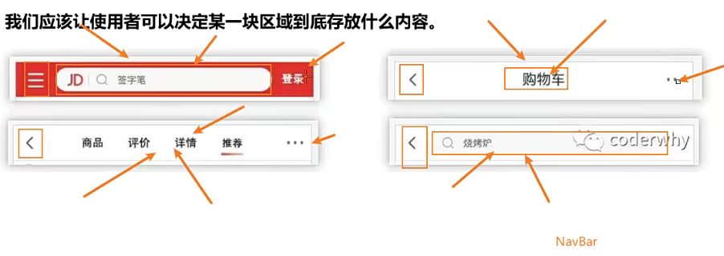
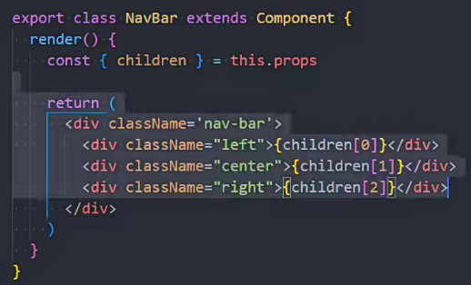
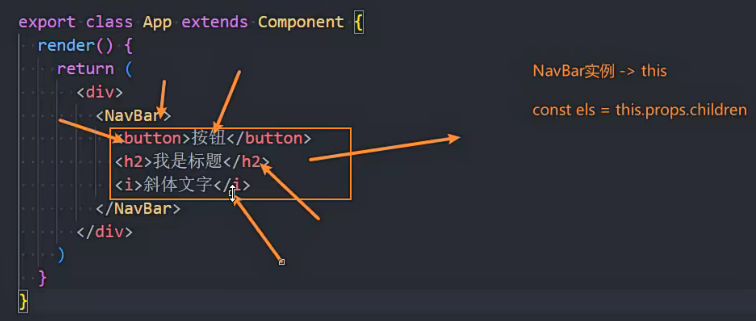
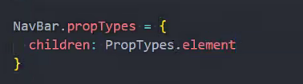
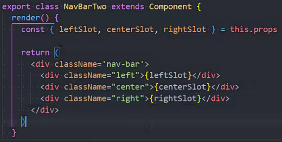

# React CDD-组件化开发

## 组件化开发概念

- 分而治之思想，便于扩展与维护，以及代码复用
- 组件 > 组件树 （应用）

## React 组件类别

- 根据定义方式
  - 函数组件
  - 类组件
- 根据组件内部是否有状态需要维护
  - 无状态组件 (Stateless Components)
  - 有状态组件 (Stateful Components)
- 根据组件不同职责
  - 展示型组件 (Presentational Component)
  - 容器型组件 (Container Component)

## React 组件生命周期

## React 组件间通信

## React 组件插槽用法

- 概念
  - 
- 组件的 `children` 子元素
  - 
  - 
  - 弊端
    - children 数量被限制
      - 1 个 (值为对象)
        - `children: button`
      - 多个 (值为对象数组)
        - `children: [button, ...]`
  - 限制只能传一个元素
    - 
- `props` 属性传递 React 元素
  - 

## React 非父子通信

## `setState` 使用详解
