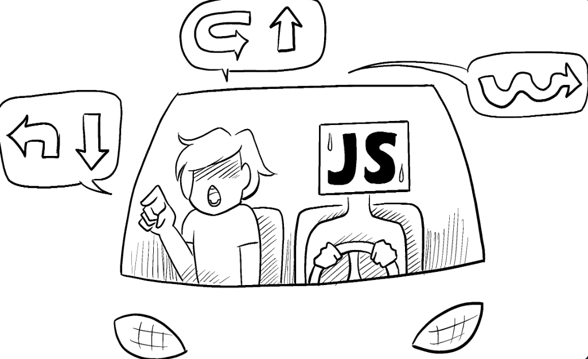
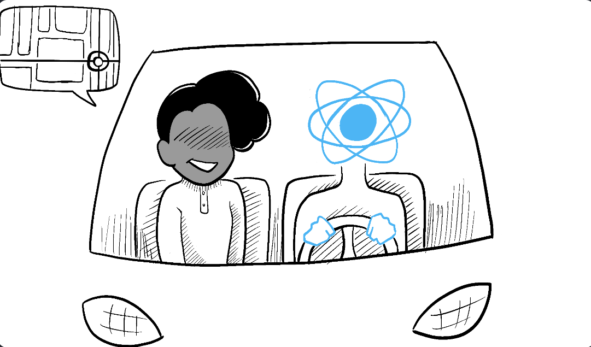

# Think in React

## Case

### 📌[ProductTableApp](../../DB-React-Components/ProductTableApp.md)

## React vs. JS

### JS

- Imperative
  - 

### React

- Declarative
  - 

## Step 1: **Break the UI** into a component hierarchy

### Splitting up a design into components

- 
- Start by drawing boxes around every component and subcomponent in the mockup and naming them.
- each component matches one piece of your data model

### Different Approaches

- _Programming_—use the same techniques for deciding if you should create a new function or object. One such technique is the [single responsibility principle](https://en.wikipedia.org/wiki/Single_responsibility_principle), that is, a component should ideally only do one thing. If it ends up growing, it should be decomposed into smaller subcomponents.
- _CSS_—consider what you would make class selectors for. (However, components are a bit less granular.)
- _Design_—consider how you would organize the design’s layers.

## Step 2: Build a **static version** in React

### build a version that renders the UI from your data model without adding any interactivity

- Building a static version requires a lot of typing and no thinking
- adding interactivity requires a lot of thinking and not a lot of typing

### don’t use state at all to build this static version

- State is reserved only for interactivity

### top down

- For simpler examples

### bottom-up

- For larger projects

### _one-way data flow_

- the data flows down from the top-level component to the ones at the bottom of the tree

## Step 3: Find the minimal but complete representation of **UI state**

### The search text

### The value of the checkbox

## Step 4: Identify **where** your state should live

## Step 5: Add **inverse data flow**
